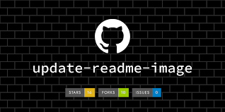

    

<h1 id="descricaoprojeto" align="center">Padrão README</h1>

Este README tem o objetivo de apresentar uma boa documentação referente a projetos no GITHUB.

#### Será apresentado:

- Badges
- Menu / Tabela de Conteúdo
- Tecnologia Utilizadas

 

  

## Tabela de Conteúdo

 <ul>
    <li><a href="#descricaoprojeto">Descrição Projeto</a></li>
    <li><a href="#tecnologia">Tecnologias</a></li>
</ul>

<!-- <a href="#descricaoprojeto">Descrição Projeto</a> | <a href="#tecnologia">Tecnologias</a> -->

## :rocket: Status do Projeto
<h4>Em construção</h4>